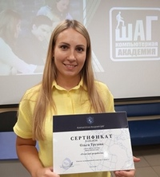

## __Volha Trukhava__
### Junior FRONT-END Developer
***
***

## S K I L L S:
* HTML5   
* CSS3   
* SCSS, SASS   
* JavaScript   
* React JS   
* Git, GitHub 
***

## E D U C A T I O N:
* IT STEP Computer Academy - course FRONT-END DEVELOPMENT  
2020 - 2021
* Gomel State Technical University named after P.O. Sukhogo -  
Economics and Enterprise Management, Economist-Manager  
2004 - 2010
***

## E X P E R I E N C E:
***

## C O N T A C T S: 
*  +375 (29) 690-70-72
*  truhovaolga911@gmail.com
*  Ольга Трухова
*  https://www.linkedin.com/in/volha-trukhava-461b76214  
*  @OlgaTruhova
*  Беларусь, Гомель

***

## L A N G U A G E S:  
* Russian - Native   
* English - A2 (Elementary)

<!--  -->

